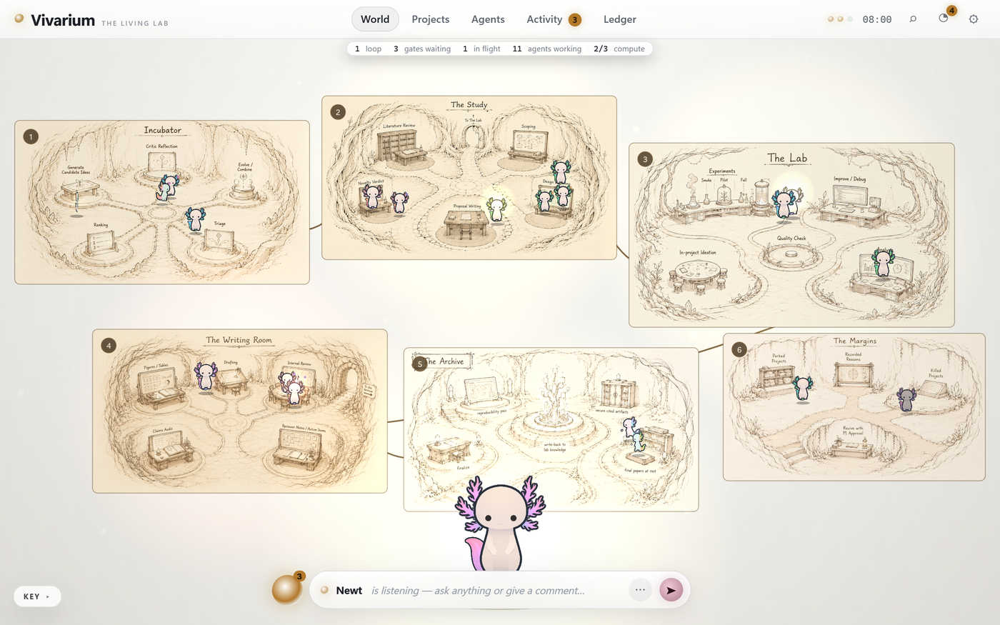
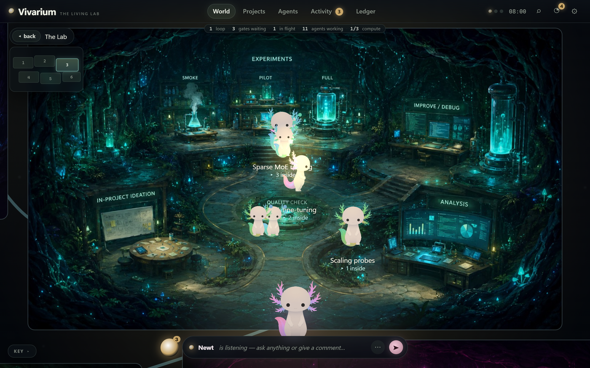
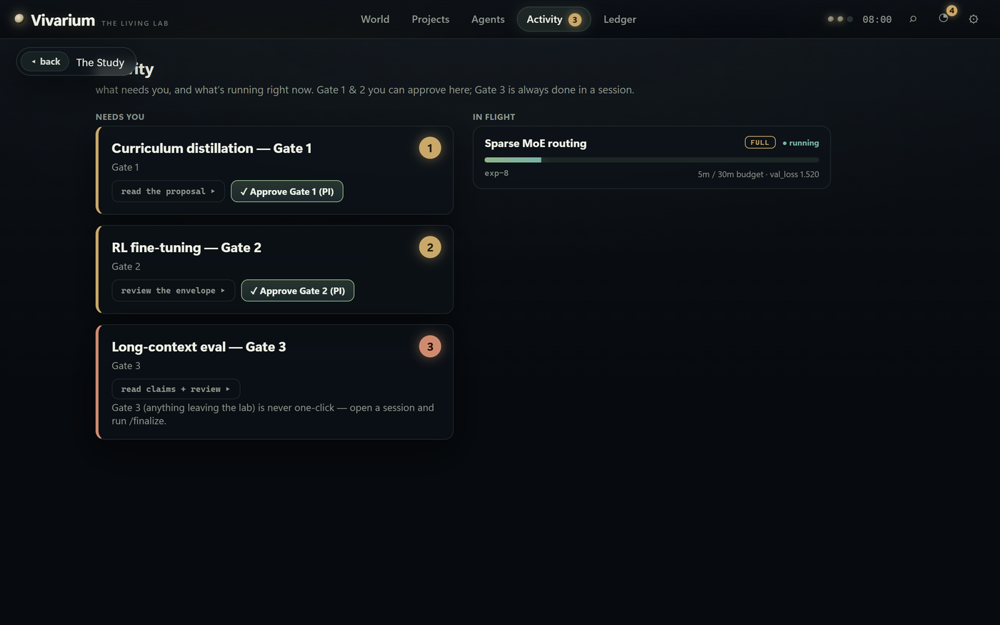
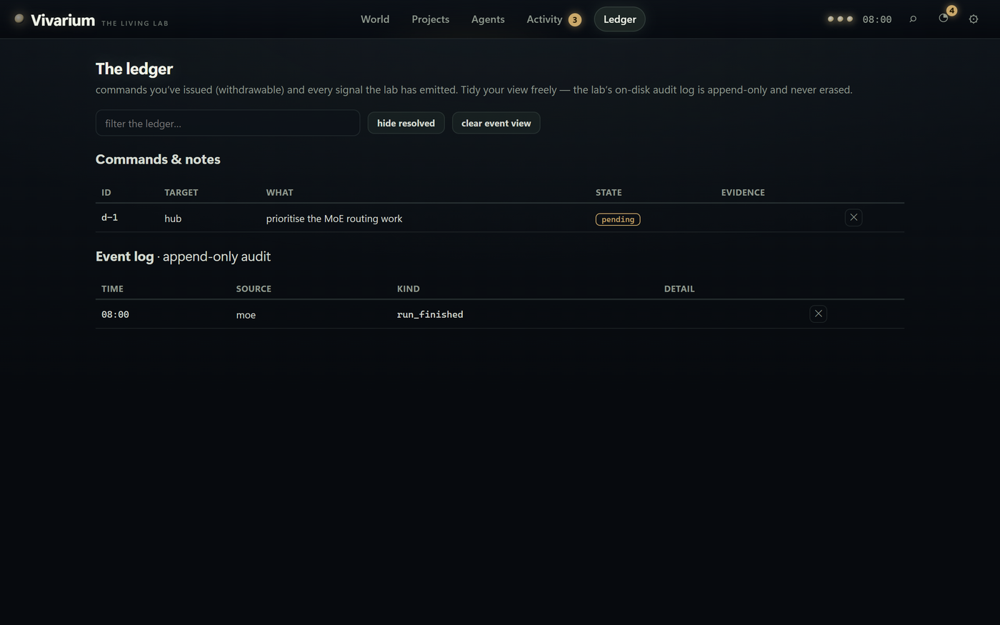

# The dashboard — Vivarium

*Optional. Local-only. Delete the `dashboard/` folder and the lab is unchanged.*

A **vivarium** is an enclosure for keeping and watching living things — which is exactly what
this is. The lab is rendered as a hand-drawn, 2.5D **living lab world** in the design language of
the game *Rain World*: muted, painterly, lo-fi, cozy-melancholic. The whole lab is **one
continuous world**, and each lifecycle stage is a **room** of it. Every idea and project is a cute
**critter** living in the room that matches its state; every working agent or subagent is its own
colour-coded critter doing visible work; and through it all roams **Newt**, the orchestrator — a
larger, unique creature who reacts to everything and is your control handle (click it to command). It keeps you in the loop while
agents iterate (hub lifecycle *and* every running external project, live) and it lets you **drive**
them.

<figure markdown>
{ .as-shot }
<figcaption>The <strong>World</strong> view — the whole lab as one continuous terrarium. Six rooms (incubator → study → lab → writing → archive → margins), each holding the ideas, projects, and worker critters currently in that lifecycle stage. Newt roams the bottom; the Key pill sits bottom-left.</figcaption>
</figure>

The whole scene is drawn on a single **Canvas-2D** surface — vanilla JavaScript, no build, no
dependencies, fully offline (see [Tech notes](#tech-notes)). There is no WebGL and nothing
vendored; the same renderer produces a still frame for `prefers-reduced-motion` and `?static`.

```bash
uv run --with pyyaml python dashboard/serve.py            # http://127.0.0.1:8787
uv run --with pyyaml python dashboard/serve.py --port 9000
```

Binds `127.0.0.1` only and reads the lab's files. It is the PI's control surface but stays
honest about what it can do (see [Controls](#controls-what-newt-can-actually-do)).

!!! tip "Try it with no lab — `?demo`"
    Open `http://127.0.0.1:8787/?demo` for a fully synthetic, living lab (agents come and go,
    runs progress, gates wait) — entirely client-side, touching no files. Add `&lamp=day` for the
    light theme. Every screenshot on this page is the demo. Click a room or a critter to zoom in.

## What it shows — the views

The living world (the rooms + the critters + Newt + the worker critters) is the canvas under
every view; the data views float over it as soft, paper-toned panels.

| View | What it is |
|---|---|
| **World** (default) | the living scene itself — a dense, non-linear region of connected lab-rooms at varied heights. An overview centred on current activity (drag to pan); every idea and project is a critter standing in the room of its current state. In **the lab** room, each project is a *single* critter; its experiment workers live *inside* it. Click a room to **cinematically zoom in** (a *back* breadcrumb appears); **click a project critter to enter its lab** — that project's workers up close, its isolated space. Hub-side ensembles (critics, reviewers) appear as critters in their own room. |
| **Projects** | every project up close as a card, with **command** and read-only **tool** buttons (status / compare / config / inbox) per project. |
| **Agents** | the roster of every working agent/subagent right now, grouped by role with live head-counts — the panel form of the worker critters you see in the world. |
| **Activity** | the live state that **needs you or is running** — two columns: **Needs you** (each pending Gate 1/2/3 as a sealed letter; **Gate 1 & 2 carry a one-click Approve button**, confirm + logged; **Gate 3** shows the command only — finalization is always done in a session) and **In flight** (one row per running run: elapsed/budget bar, last metric, stalled flag). A badge on the tab counts what's waiting. |
| **Ledger** | evidence: the commands & notes you’ve issued (with their `pending → seen → done` state and evidence pointer) and the full event log, as tables. A `done` with no evidence is flagged. |

A **"now happening" pulse strip** runs along the top-centre of the World — an at-a-glance summary
of what is live right now: running loops, waiting gates, in-flight runs, and how many agents are
working. It is the one line you can read without panning anywhere.

**Lamplight** is a simple **Light / Dark** toggle (the `🌙` button or Settings; default Dark — the
scene is dark-first), shifting the world's ambient between a brighter daytime and a dim, lantern-lit
dusk. If file-tailing stalls, the masthead clock turns red, so degraded data never reads as calm.

<figure markdown>
{ .as-shot }
<figcaption>The same World in the <strong>Light</strong> theme — every room, corridor, and critter re-lit for daytime. Light/Dark is one toggle; the choice persists per browser.</figcaption>
</figure>

## The world — the rooms

The lab is one world — a dense, organic region whose rooms sit at varied heights and join by
tunnels (it is deliberately *not* a tidy left-to-right row), though they still follow the lifecycle
order. Each stage is a **room** whose art signals what that stage *is*; an idea or project lives in
the room matching its current registry state, and moves rooms as it advances. The rooms:

The world groups the lifecycle into **six rooms** (a presentation grouping over the registry
states — it never changes the lifecycle itself; see `DASHBOARD.md` §4). Gates are the *doorways*
between rooms:

| Room | Covers (lifecycle states) |
|---|---|
| **the incubator** | `seed`, `triaged` — ideas are born and sorted |
| **the study** | `lit-review`, `scoping`, `proposal` — shape the idea before spending compute (**Gate 1** is the door out) |
| **the lab** | `active`, `analysis` — the busiest room: experiments + their analysis (**Gate 2** inside). Each project is one critter; **click it to enter that project's own lab** and see all its workers |
| **the writing room** | `writing`, `internal-review` — draft the paper and review it (**Gate 3** is the door out) |
| **the archive** | `final` — finished, at rest; its knowledge feeds the next idea |
| **the margins** | `parked` (dimmed) and `killed` (sunk, desaturated) — out of play |

Each idea/project critter's look reflects its situation: a live run makes its room and its critter
active, a killed idea's critter sinks and greys out in the compost, a parked one rests dim on the
quiet shelf.

<figure markdown>
{ .as-shot }
<figcaption>Click a room (or a project critter) to <strong>zoom in</strong>. Here, inside <em>the lab</em>: stations for smoke/pilot/full, improve/debug, in-project ideation, quality-check, and analysis — with each running worker critter standing at its task, labelled with what it's doing.</figcaption>
</figure>

## Newt — the buddy that is also the controller

Newt is the lab's buddy and its **orchestrator** — a unique, procedurally-animated creature, larger
than the worker critters (its own simple, cute salamander-like look; deliberately *not* an axolotl
and *not* a Rain-World slugcat). It roams the world toward wherever the lab's attention is, and you
**click it to command the lab** (the legend's *Orchestrator (Newt)* row is this same creature). Its body is an honest
one-glance summary of the lab, driven by the same nine poses as before, by priority:
**gate-waiting > fresh-failure > success > regenerating (a pivot) > running > writing > composing a
letter > idle > asleep**. Newt drifts low and dim when the lab is cold, perks up while runs are
live, blooms on a success, dims on a failure, turns toward the proposal/review rooms when a gate
waits, and forms a letter when you’re composing a command.

The **regeneration lore is preserved**, now made literal in the new art: on a re-plan or explore
event (`replan` / `decision_revisit` / `frontier_expand` / `approach_ideate`) one of Newt's
**fronds dissolves into motes and regrows** — explore-mode's discard-and-regrow shown, not just
told, with the original wink at Newton. Speech bubbles quote event fields **verbatim** — no number
Newt can’t cite to an event.

## The workers — a critter per agent

Underneath the idea/project critters, the world shows **the work itself**: every running
agent or subagent is **its own critter**, colour-coded by role. Six roles:

| Role | Colour | Note |
|---|---|---|
| **orchestrator** | gold | this *is* **Newt** — the larger, haloed creature that roams between rooms; the legend's orchestrator count is Newt, and you click Newt to command the lab |
| **experiment-runner** | teal | |
| **fresh-context-reviewer** | violet | |
| **overseer** | slate-blue | |
| **ideation-critic** | rose | |
| **scoping-advocate** | amber | |

Each worker critter lives in the room where its task is happening, so you can *see* a review
ensemble fill the review panel or runners crowd the wet lab. Same-role workers are differentiated
**deterministically** — hue, marking, and walk-phase are derived from the worker's id, so the same
worker always looks the same. When a worker finishes its task it plays a **despawn animation**
(it dissolves into motes). When a room gets crowded, the extra workers collapse into a single
**"+N more"** cluster so the scene stays readable.

A **legend** ("Who's working", bottom-left) is always visible: each role → its colour with a live
head-count. Click a role to **highlight** every critter of that role across the world.

**Click a worker critter** to open an **inspector panel** showing that one worker's own clean
action history — exactly what *that* agent did, in order, separated from everyone else's. This is
backed by the per-worker logs described in [Traceability](#traceability-one-log-per-worker).

## Controls — what Newt can actually do

Click **Newt** — the orchestrator creature, who roams the world — or any other critter, to open
the **command console** (the footer also carries a persistent Newt handle). One honest constraint shapes
all of it: the dashboard is a local Python server — it can’t *run* an agent skill (that’s the
Claude session). So it works in three tiers:

1. **Structured commands** → the bus. Buttons like *Start loop ▸ execute/explore*, *Stop loop*,
   *Run smoke*, *Request a run*, *Analyze*, *Prioritize*, *Park*, *Kill* (and *Ideate* for the
   hub) append a `kind:"command"` directive to the target’s `directives.jsonl`. The running
   agent picks it up at its **next checkpoint** (a loop cycle / session start — the console says
   so) and executes it **in-protocol**, then acks `seen → done`(+evidence) / `blocked`. A
   command is never gate approval and can’t change a frozen/PI-owned setting.
2. **Read-only tools** → run now. The per-project buttons execute whitelisted, side-effect-free
   tools (`check_lab`, `show_config`, `status`, `compare`, `inbox`, slot status) as subprocesses
   and show the output in a drawer. Nothing that trains or writes.
3. **PI gate approval** (Gate 1 & 2 only). Because the server is local and you are the PI, the
   Gates view (or a critter’s console) can record your approval directly: Gate 1 signs the proposal
   and leaves the agent a `gate1_approved` command to transition + spawn; Gate 2 flips
   `gate2_envelope.pi_signed: true` (with `signed_via: dashboard:<ts>`) in `control.yaml`. Every
   gate click needs an explicit confirm and is written to `lab/.bus/pi-actions.jsonl`.
   **Gate 3 is never approvable here** — sending anything outside the lab is always done in a
   session. That is the one hard line.

You can also leave a **free-text note** from the same console when no button fits.

<figure markdown>
{ .as-shot }
<figcaption>The <strong>Activity</strong> view is the control surface: <em>Needs you</em> (Gate 1 & 2 with a one-click <em>Approve</em>; Gate 3 shows only the command — it's never approvable here) beside <em>In flight</em> (the running experiment with its budget bar). Approvals are confirmed and written to the append-only audit.</figcaption>
</figure>

## How it stays honest (the bus)

<figure markdown>
{ .as-shot }
<figcaption>The <strong>Ledger</strong> makes the dashboard auditable: every command you've issued (with its <code>pending → seen → done</code> state and evidence pointer) and the full, append-only event log. A <code>done</code> with no evidence is flagged — nothing on screen is unbacked.</figcaption>
</figure>

Everything shown is backed by a real file. The signal layer is **the bus** — append-only JSONL,
the same philosophy as the rest of the lab:

- **Mechanical events** (reliable regardless of agent discipline): `scripts/run.py` and
  `sweep.py` emit `run_started`/`run_finished`/`sweep_*`; `tools/run_slots.py` emits slot events.
  These fire from code, so the scene is truthful even if an agent forgets to narrate.
- **Agent events**: at registry changes, gate stops, loop cycles, pivots, kills, and write-backs
  the agent emits via `lab_bus.py emit <kind>`. Live metric ticks aren’t duplicated — the
  dashboard tails each run’s `metrics.jsonl` directly.
- **Commands, directives, acks, and PI gate actions** flow through the same files; the dashboard
  only ever *appends* (and, for a Gate-2 sign, edits the one `pi_signed` line it’s told to).

Event kinds: `session_start/end`, `state_change`, `gate_waiting`, `gate_resolved`,
`run_started/finished`, `sweep_started/finished`, `slot_acquired/released/denied/reclaimed`,
`cycle`, `review_verdict`, `paper_compiled`, `kill`, `writeback`, `directive_seen/done/blocked`,
`frontier_expand` (explore loop proposed new lines), `decision_revisit` (reopened a design
decision), `replan` (a pivot landed), `approach_ideate` (in-project method-ideation proposed
candidate approaches), `escalation` (a project loop asking the hub/PI for attention mid-run —
a headline reopen, a block on a frozen setting, or FULL work outside the envelope; requests
attention, never grants a gate), `score_read` (a target-driven `/compete` project read an
external score under its PI-signed envelope — `scripts/report_score.py`), `agent_launched` /
`agent_finished` (a headless top-level agent was spawned into / finished in a project by
`tools/agent_runner.py` — its full transcript is in `<project>/.bus/agents/<id>.stream.jsonl`),
`note`. The bus lives in gitignored `lab/.bus/` (hub) and
`<project>/.bus/` (each project); a project spawned before the bus existed still shows
runs/registry/liveness — events only enrich.

## Traceability — one log per worker

The worker critters and their per-worker inspector histories are backed by a **lab feature that is
independent of the dashboard**: even if you delete `dashboard/`, these logs still get written.

Claude Code **hooks** (`.claude/settings.json` → `tools/trace_hook.py`, and the same hook shipped
in the project template) log every agent's and subagent's tool actions to **per-worker logs** —
one file per worker:

- `lab/.bus/workers/<worker_id>.jsonl` in the hub, and
- `<project>/.bus/workers/<worker_id>.jsonl` in each project.

One file per worker means each agent's trace is clean and separated from every other's — which is
exactly what the worker inspector renders. `dashboard/sources.py` aggregates these files into a new
`snapshot().workers[]`, and the dashboard draws one critter plus one inspectable history per
worker.

Two properties keep this safe and lightweight:

- It is **best-effort and never blocks a tool call** — a failed or slow hook never holds up the
  agent. The logs are local and disposable (gitignored).
- The **harness writes them, not the subagents.** The hook fires from Claude Code, so the
  parent-only-ledgers rule (subagent rule 3) is untouched — subagents still write nothing to the
  shared ledgers; the trace is the harness observing them, not them reporting.

## Tech notes

`dashboard/serve.py` is a stdlib `ThreadingHTTPServer` (+ pyyaml) serving a no-build single-page
scene. Endpoints: `GET /api/state` (a snapshot rebuilt from files on every request — the lab’s
files are the database), `GET /api/events` (Server-Sent Events, ~1.5 s poll — Windows-honest, no
native watcher), `POST /api/directive` and `POST /api/command` (append to the bus), `POST /api/tool`
(run a whitelisted read-only tool), `POST /api/gate` (record a confirmed Gate 1/2 approval; Gate 3
refused). The first HTML response is seeded with the snapshot inline for an instant cold load.
`dashboard/sources.py` holds the tolerant tailers (a bad line is skipped, a moved project is
reported unreachable, never a crash) and now also aggregates the per-worker logs into `workers[]`.

The frontend (`static/index.html`, `terrarium.css`, `app.js`) is **vanilla JavaScript — no build,
no dependencies, fully offline**. The living world renders entirely on a single **Canvas-2D**
surface (a hand-drawn, painterly 2.5D scene); there is **no WebGL**, and **Three.js and the whole
`static/vendor/` tree have been removed** — the Canvas-2D renderer is the only renderer. It honors
`prefers-reduced-motion` and `?static` by drawing a single **still frame** of the same scene
instead of animating, so the dashboard stays delete-it-and-nothing-changes and always works
offline with zero assets to fetch. A handy deep link: `?open=<idea|hub>` opens the command console
straight to that target.
