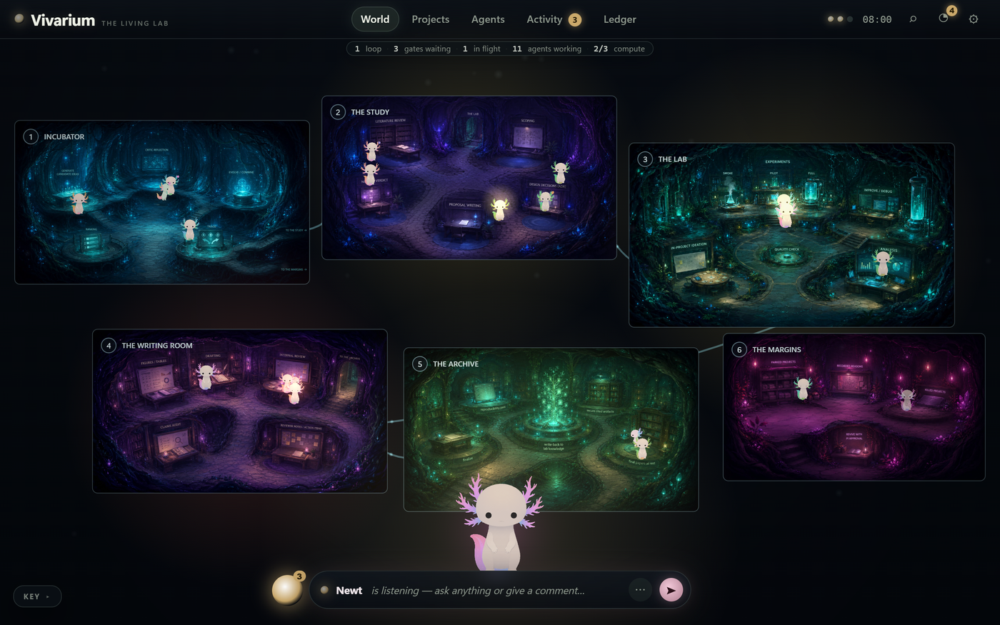
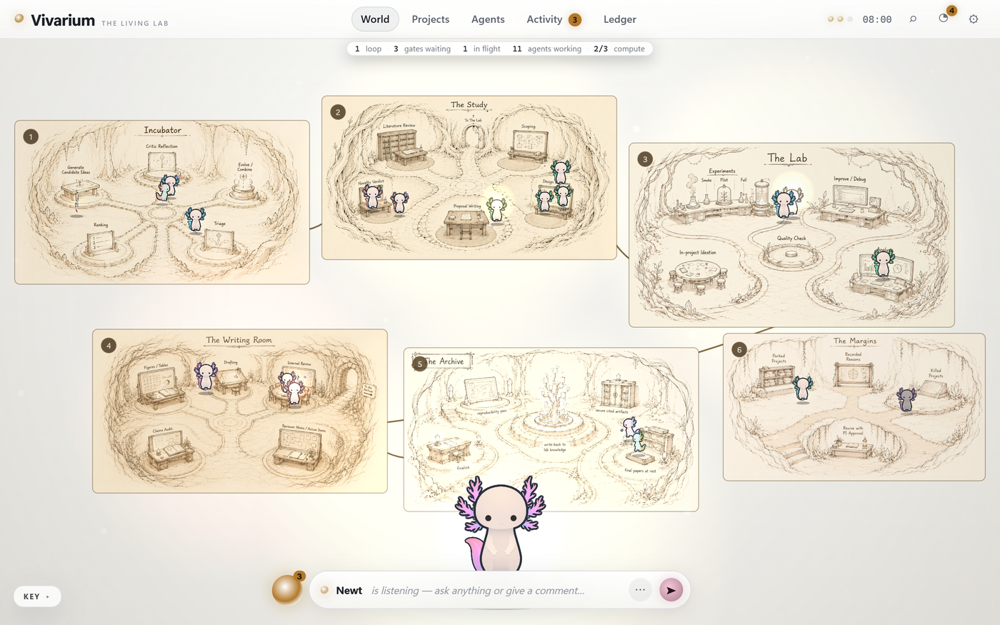
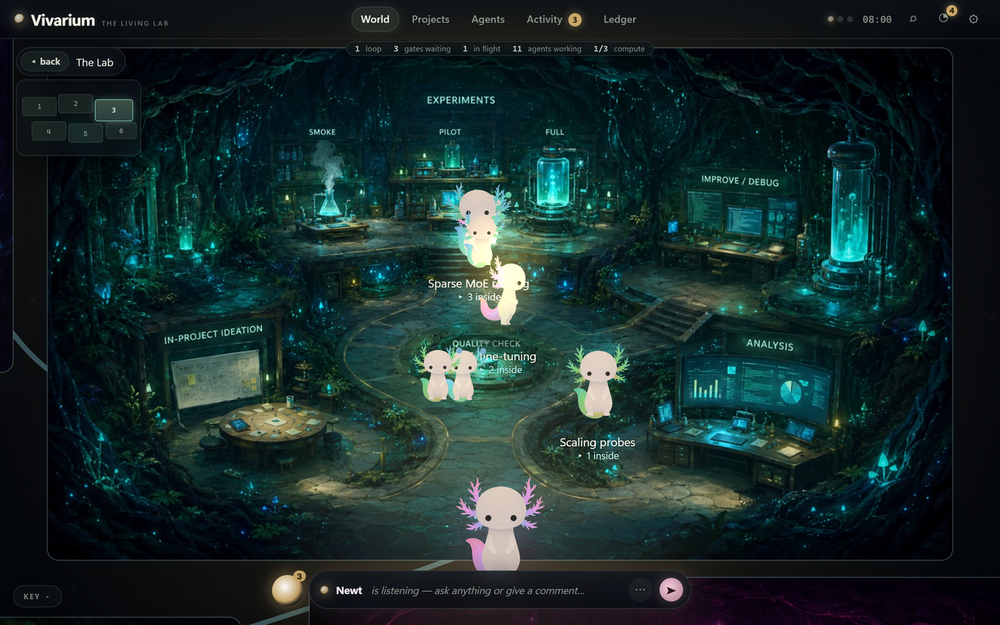
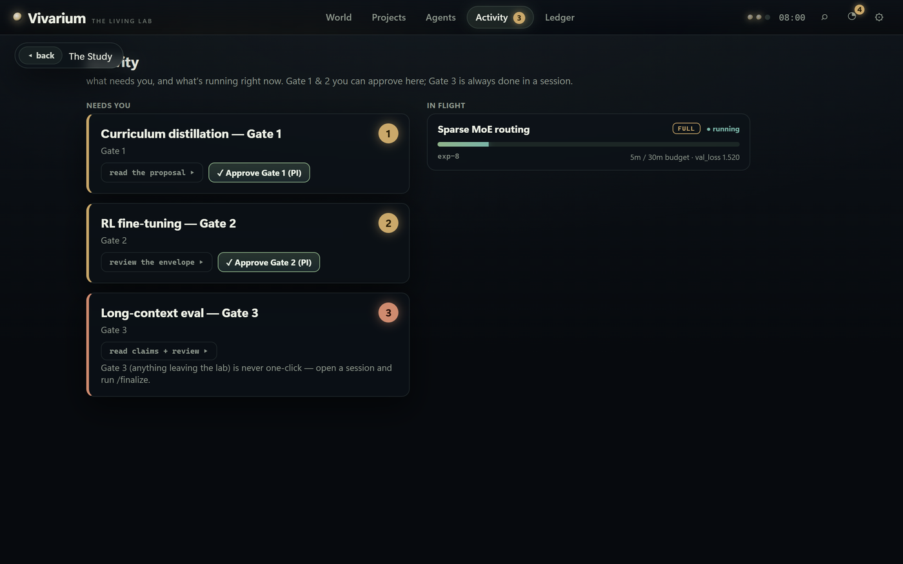
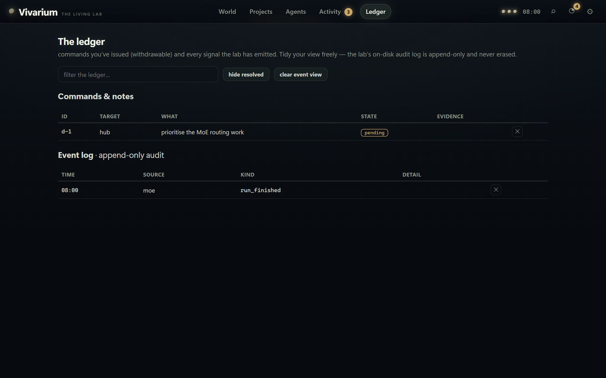

# The dashboard — Vivarium

*Optional. Local-only. Delete the `dashboard/` folder and the lab is unchanged.*

Vivarium renders the lab as a hand-drawn, 2.5D **living world**: the whole lab is **one continuous
scene**, and each lifecycle stage is a **room** of it. Every idea and project is a single **critter**
living in the room that matches its state (an idea and the project it grows into are the *same*
critter, not two); every working agent or subagent is its own colour-coded
**sub-newt** doing visible work; and through it all roams **Newt** — the orchestrator, a larger
creature that reacts to lab state and is your control handle (click it to command). It keeps you in
the loop while agents iterate (hub lifecycle *and* every running external project, live) and lets
you **drive** them.

<figure markdown>
{ .as-shot }
<figcaption>The <strong>World</strong> view — the whole lab as one continuous scene. Six rooms (incubator → study → lab → writing → archive → margins), each holding the ideas, projects, and sub-newts currently in that lifecycle stage. Newt roams the bottom; the Key pill sits bottom-left.</figcaption>
</figure>

The scene is drawn on a single **Canvas-2D** surface — vanilla JavaScript, no build, no
dependencies, fully offline (see [Tech notes](#tech-notes)). The same renderer produces a still
frame for `prefers-reduced-motion` and `?static`.

```bash
uv run --with pyyaml python dashboard/serve.py            # http://127.0.0.1:8787
uv run --with pyyaml python dashboard/serve.py --port 9000
uv run --with pyyaml python dashboard/serve.py --hub ../other-lab   # serve another lab
```

Binds `127.0.0.1` only and reads the lab's files. It is the PI's control surface and stays honest
about what it can do (see [Controls](#controls-what-newt-can-actually-do)). With **programmatic
launching** on (a PI-owned switch, off by default — flip it in ⚙ Settings), it is the **central
interface**: you launch procedures as headless agent sessions, watch them (and every subagent) live,
answer their questions, and stop or resume them — see [Running procedures](#running-procedures-headless-runs).
With it off, it **observes and signs; the agent executes**: commands and approvals are recorded to
the file bus and take effect when a Claude session next reaches an inbox checkpoint.

!!! note "Fresh lab?"
    Against a brand-new lab (empty `lab/REGISTRY.md`, no bus yet) the world is intentionally
    empty: no critters, nothing in Activity, no gates to approve. Gates appear once a proposal is
    written. With programmatic launching on, start from the command sheet (⋯ → *Run a procedure* →
    `/ideate`, or `/setup-lab` as an interview); with it off, commands are queued for your next session.

!!! tip "Try it with no lab — demo mode (debugging)"
    Demo is a synthetic, living lab (agents come and go, runs progress, gates wait) — entirely
    client-side, touching no files. It's a debugging/showcase mode, so it's **off by default and not
    exposed in the UI**: start the server with `--demo` (or `VIVARIUM_DEMO=1`), then open
    `http://127.0.0.1:8787/?demo` (add `&lamp=day` for the light theme). Every screenshot on this
    page is the demo. Click a room or a critter to zoom in. In demo, every **control** — commands,
    notes, the gate Approve buttons — is simulated: nothing is written and no agent acts.

## What it shows — the views

The living world (the rooms + the critters + Newt + the sub-newts) is the canvas under
every view; the data views float over it as soft, paper-toned panels.

| View | What it is |
|---|---|
| **World** (default) | the living scene itself — a dense, non-linear region of connected lab-rooms at varied heights. An overview centred on current activity (drag to pan); every idea and project is a critter standing in the room of its current state. In **the lab** room, each project is a *single* critter; its experiment sub-newts live *inside* it. Click a room to **cinematically zoom in** (a *back* breadcrumb appears); **click a project critter to enter its lab** — that project's sub-newts up close, its isolated space. Hub-side ensembles (critics, reviewers) appear as sub-newts in their own room. |
| **Projects** | every project up close as a card, with **command** and read-only **tool** buttons (status / compare / config / inbox) per project. A card carries a **Gate-2 envelope burn-down chip** (`⛽ FULL 2/6 · 60/300m · exp 07-15` — booked vs. signed caps, coloured by status) when the project has an envelope, **headless** / **asking you** chips when a launched run is live or waiting on your answer, and **view paper** once its paper compiles; the detail drawer adds **open in editor**, the envelope chip, and a **Headless runs** section — each run clickable into its live view. |
| **Library** | **every research document the lab writes, organized and beautifully rendered.** A left shelf: **The Lab** layer (pre-project **ideation** worksheets · **knowledge** · **notebook** · campaigns) above **one group per study** (IDEA → lit-review → decisions → proposal → sessions → critiques → paper + reviews) with the spawned **project repo's ledgers** (PLAN · EXPERIMENT_LOG · NOTES · TARGET · LOOP_BRIEF · analysis) resolved across the hub↔project boundary. The right pane renders Markdown with real typography, GFM tables, code blocks, **KaTeX math** (`$…$`/`$$…$$`), YAML front-matter as a chip strip, and doc-relative images inline — all offline (vendored `marked` + `DOMPurify` + KaTeX, `static/vendor/`). Filter box on top; every doc keeps its **open in editor ▸** link. **Every "read a document" action in the dashboard lands here** (gate bundles included); only raw run artifacts and tool output keep the bottom drawer. |
| **Agents** | **headless runs** first (every run you launched — running, waiting for you, queued, finished — as cards that open the [run view](#running-procedures-headless-runs)), then **every agent with its subagents nested under it**, grouped by where it works: each shows its label (the spawn's description — *"Novelty skeptic: sparse attention"*, *"variant exp-004"*), role, what it is doing right now (including *in Bash since 14:02* during a long training call), and — for finished subagents, which stay visible, greyed, for 30 minutes — what it handed back. |
| **Activity** | the live state that **needs you or is running**. A **"Since your last visit"** banner heads it (runs finished, gates opened, escalations, kills, write-backs since you were last here — dismissable), then a **hub-health strip** (notebook write-back age, one-click *check lab* / *show config*), then two columns: **Needs you** (a run's **question** to answer, a run that stopped at a gate or a kill criterion, a crashed run to resume, denied actions, escalations — each with its action buttons; then each pending Gate 1/2/3 as a sealed letter that opens a **composed review bundle** — see below; **Gate 1 & 2 carry a one-click Approve button**, confirm + logged; after Gate 1 the card offers **▸ launch /spawn-project**; **Gate 3** shows the command only — finalization is always done in a session) and **In flight** (headless runs, then one row per running experiment run: elapsed/budget bar, last metric, stalled flag). A badge on the tab counts what's waiting. |
| **Ledger** | evidence: the commands & notes you’ve issued (with their `pending → seen → done` state and evidence pointer) and the full event log, as tables. A `done` with no evidence is flagged. |

### Gate review bundles — decide a gate without leaving the dashboard

A PI gate is the one place the lab *needs* you, so each gate's preview is a **composed bundle** that
gathers everything the decision rests on into one read-only view, rendered in the **Library** reader
(the `review … ▸` button on the Activity card, or the `read` link in the approve dialog):

- **Gate 1** — the lit-review's **novelty verdict** + the proposal's **budget · kill criteria ·
  success criteria** lifted to the top, then the full proposal.
- **Gate 2** — an **envelope-capacity** readout (signed/expiry/`signed_via`; the `full_runs`/per-run/
  total caps; completed + reserved FULL runs and minutes already booked; **remaining** runs/minutes —
  the same accounting `guard.py full-run` enforces, so the PI sees before signing whether a request
  even fits), then the raw `gate2_envelope`, the **completed PILOT runs** that justify scaling, then
  `control.yaml`.
- **Gate 3** — `claims.yaml` + the **meta-review verdict** (decision + Overall score) + every review
  and author-response, found recursively under `paper/reviews/`. The compiled PDF opens in the paper
  viewer; the claims map (below) opens beside it. (Gate 3 stays read-only — `/finalize` in a session.)

Each section that maps to a real file keeps its **open in editor** link.

### Claims ↔ artifact map — hard rule 1, made visible

The **claims (N)** button (on a project card, the Gate-3 card, the paper viewer, or the palette)
opens `studies/<slug>/paper/claims.yaml` as a checklist: every claimed number with its metric,
location, and derivation, traced to the **run artifact(s)** it comes from. Each artifact is resolved
on disk — **peek** opens its `metrics.json` in the doc viewer, **editor** jumps to it — and a
**● linked / ⚠ missing** pill shows whether every cited artifact is present. This surfaces the
lab's traceability guarantee (every number → a run) for a reviewer to see, not just trust. The pill
is *linkage*, not a numeric audit — **run audit ▸** launches the mechanical
`tools/audit_claims.py` (read-only; PASS / FAIL / MANUAL per claim) right there.

### Reading the paper & jumping to code

Two ways the dashboard hands you off to the real artifacts, without ever leaving its read-only,
local-only posture:

- **Paper viewer.** When a project's paper has compiled (`studies/<slug>/paper/main.pdf` — the
  blocking `latexmk` gate in `/write-paper`), a **view paper** button opens it in a large overlay
  rendered by your browser's native PDF viewer, with a strip of the paper's **figures** beneath it.
  It **auto-refreshes**: when the agent recompiles, the snapshot's mtime changes and the open PDF
  reloads itself — watch the paper redraw as the back-half work lands. **edit source ▸** opens
  `main.tex` in your editor; **open PDF ▸** pops it into a new tab. The dashboard never *compiles* —
  it only surfaces what the pipeline produced (compilation stays in `/write-paper`).
- **Open in editor.** Because the dashboard binds localhost and is driven by you, every read-only
  document view (a proposal, `control.yaml`, a run's `metrics.json`, the lab knowledge) carries an
  **open in editor ▸** link on each file's header, and a project's detail drawer has an **open in
  editor** button. They emit a `<scheme>://file/<abs-path>` URL that your editor's URL handler
  catches. The scheme is `lab/config.yaml` → `dashboard.editor` (`vscode` default; `cursor`,
  `vscodium`, `windsurf`, or `none` to turn the links off).

A **"now happening" pulse strip** runs along the top-centre of the World — an at-a-glance summary
of what is live right now: running loops, waiting gates, in-flight runs, and how many agents are
working. It is the one line you can read without panning anywhere. The masthead's **compute-slot
fireflies** (one lit mote per busy slot) name each slot's holder on hover (project · label · age)
and turn a **stale** slot amber — one whose heartbeat lapsed past `compute.stale_slot_minutes`, so it
reads as presumed-crashed rather than silently "in use" (reclaim is `run_slots.py`'s job, never the
dashboard's).

**Lamplight** is a simple **Light / Dark** toggle (the `🌙` button or Settings; default Dark — the
scene is dark-first), shifting the world's ambient between a brighter daytime and a dim, lantern-lit
dusk. If file-tailing stalls, the masthead clock turns red, so degraded data never reads as calm.

<figure markdown>
{ .as-shot }
<figcaption>The same World in the <strong>Light</strong> theme — every room, corridor, and critter re-lit for daytime. Light/Dark is one toggle; the choice persists per browser.</figcaption>
</figure>

## The world — the rooms

The lab is one world — a dense region whose rooms sit at varied heights and join by tunnels
(deliberately *not* a tidy left-to-right row), though they still follow the lifecycle order. Each
stage is a **room** whose art signals what that stage *is*; an idea or project lives in the room
matching its current registry state, and moves rooms as it advances.

The world groups the lifecycle into **six rooms** (a presentation grouping over the registry
states — it never changes the lifecycle itself; see `DASHBOARD.md` §4). Gates are the *doorways*
between rooms:

| Room | Covers (lifecycle states) |
|---|---|
| **the incubator** | `seed`, `triaged` — ideas are born and sorted |
| **the study** | `lit-review`, `scoping`, `proposal` — shape the idea before spending compute (**Gate 1** is the door out) |
| **the lab** | `active`, `analysis` — the busiest room: experiments + their analysis (**Gate 2** inside). Each project is one critter; **click it to enter that project's own lab** and see all its workers |
| **the writing room** | `writing`, `internal-review` — draft the paper and review it (**Gate 3** is the door out) |
| **the archive** | `final` — finished, at rest; its knowledge feeds the next idea |
| **the margins** | `parked` (dimmed) and `killed` (sunk, desaturated) — out of play |

Each idea/project critter's look reflects its situation: a live run makes its room and its critter
active, a killed idea's critter sinks and greys out, a parked one rests dim.

<figure markdown>
{ .as-shot }
<figcaption>Click a room (or a project critter) to <strong>zoom in</strong>. Here, inside <em>the lab</em>: stations for smoke/pilot/full, improve/debug, in-project ideation, quality-check, and analysis — with each running sub-newt standing at its task, labelled with what it's doing.</figcaption>
</figure>

## Newt — the buddy that is also the controller

Newt is the lab's buddy and its **orchestrator**: a unique, procedurally-animated creature, larger
than the sub-newts. It roams the world toward wherever the lab's attention is, and you **click it to
command the lab** (the legend's *Orchestrator (Newt)* row is this same creature). Its body is an
honest one-glance summary of the lab, driven by nine poses, by priority:
**gate-waiting > fresh-failure > success > regenerating (a pivot) > running > writing > composing a
letter > idle > asleep**. Newt drifts low and dim when the lab is cold, perks up while runs are
live, blooms on a success, dims on a failure, turns toward the proposal/review rooms when a gate
waits, and forms a letter when you’re composing a command.

On a re-plan or explore event (`replan` / `decision_revisit` / `frontier_expand` /
`approach_ideate`) one of Newt's **fronds dissolves into motes and regrows** — explore-mode's
discard-and-regrow, shown rather than told. Speech bubbles quote event fields **verbatim** — no
number Newt can’t cite to an event.

## The workers — a sub-newt per agent

Underneath the idea/project critters, the world shows **the work itself**: every running
agent or subagent is **its own sub-newt**, colour-coded by role. Six roles:

| Role | Colour | Note |
|---|---|---|
| **orchestrator** | gold | an interactive session is **Newt** — the larger creature at the bottom of the world (click Newt to command the lab); a *headless run's* orchestrator appears as its own sub-newt in the room of what it's working on |
| **experiment-runner** | teal | |
| **fresh-context-reviewer** | violet | |
| **overseer** | slate-blue | |
| **ideation-critic** | rose | |
| **scoping-advocate** | amber | |

Each sub-newt lives in the room where its task is happening, so you can *see* a review
ensemble fill the review panel or runners crowd the lab. Same-role workers are differentiated
**deterministically** — hue, marking, and walk-phase are derived from the worker's id, so the same
worker always looks the same. When a worker finishes its task it plays a **despawn animation**
(it dissolves into motes).

**The Key** (bottom-left) maps each role to its colour with live counts; click a role to **highlight**
every sub-newt of that role across the world.

**Click a sub-newt** (or its card in the Agents tab) to open an **inspector panel**: its label and
role, **who spawned it** (↑ one click to the parent), its **subagents** (one click each), the tool
it is **inside right now** and since when, what it **handed back** (the result packet / final
message), and its full action timeline — exactly what *that* agent did, separated from everyone
else's. A worker inside a long tool call stays *working* (it never drops off the roster mid-run);
one silent with no open tool goes *idle*, and a subagent silent for 20 minutes shows up in *Needs
you*. This is backed by the per-worker logs described in [Traceability](#traceability-one-log-per-worker).

## Controls — what Newt can actually do

Click **Newt** — the orchestrator creature — or any other critter, to open the **command console**
(the footer also carries a persistent Newt handle). It works in four tiers:

0. **Run a procedure** (when programmatic launching is on). The console's *Run a procedure* box
   launches any **whitelisted** lab procedure for the chosen target as a headless agent session —
   hub-level (`/lab-status`, `/ideate`, `/propose`, `/advance`, `/review-paper`, `/autopilot continue
   <brief>`, …) or inside a project (`/experiment`, `/improve`, `/research-loop`); interviews
   (`/discuss`, `/compete`, `/setup-lab`) work too, one question per turn. Pick the backend (claude ·
   codex · opencode — only installed ones are offered) and what happens when it finishes: *stop*,
   *run its reported next step*, or *keep going until a gate*. `/finalize` is never offered. See
   [Running procedures](#running-procedures-headless-runs).
1. **Structured commands** → the bus. Buttons like *Start loop ▸ execute/explore*, *Stop loop*,
   *Set mode ▸ explore/execute* (switch a live loop without restarting it), *Run smoke*,
   *Request a run*, *Analyze*, *Prioritize*, *Park*, *Kill* (and *Ideate* for the
   hub) append a `kind:"command"` directive to the target’s `directives.jsonl` (the record carries
   its `target`, so a command aimed at a not-yet-spawned idea is never misattributed). The running
   agent picks it up at its **next checkpoint** (a loop cycle / session start — the console says
   so) and executes it **in-protocol**, then acks `seen → done`(+evidence) / `blocked`. A
   command is never gate approval and can’t change a frozen/PI-owned setting. With launching on,
   the commands marked *starts a run now* (*Run smoke*, *Request a run*, *Start loop*, *Analyze*,
   *Ideate*) also launch the procedure that consumes them, and *Stop loop* stops a live
   `/research-loop` run — the directive is still written, so an in-session agent sees it too.
2. **Read-only tools** → run now. The per-project buttons execute whitelisted, side-effect-free
   tools (`check_lab`, `show_config`, `status`, `compare`, `inbox`, slot status) as subprocesses
   and show the output in a drawer. Nothing that trains or writes.
3. **PI gate approval** (Gate 1 & 2 only). Because the server is local and you are the PI, the
   Gates view (or a critter’s console) can record your approval directly: Gate 1 signs the proposal
   and leaves the agent a `gate1_approved` command to transition + spawn; Gate 2 flips
   `gate2_envelope.pi_signed: true` (with `signed_via: dashboard:<ts>`) in `control.yaml`. Every
   gate click needs an explicit confirm and is written to `lab/.bus/pi-actions.jsonl`.
   An approval **records the signature only** — the registry transition + spawn (Gate 1) or the
   FULL runs (Gate 2) happen in the next run or session. With launching on, a signed Gate 1 offers
   **▸ launch /spawn-project** (or queues it itself with `dashboard.auto_spawn_on_gate1: true`);
   with it off, start a session (`claude` → `/lab-status`).
   **Gate 3 is never approvable here** — sending anything outside the lab is always done in a
   session. That is the one hard line.

You can also leave a **free-text note** from the same console when no button fits.

<figure markdown>
{ .as-shot }
<figcaption>The <strong>Activity</strong> view is the control surface: <em>Needs you</em> (Gate 1 & 2 with a one-click <em>Approve</em>; Gate 3 shows only the command — it's never approvable here) beside <em>In flight</em> (the running experiment with its budget bar). Approvals are confirmed and written to the append-only audit.</figcaption>
</figure>

## Running procedures (headless runs)

With **programmatic launching** on (⚙ Settings → *Agents & launching*; it writes
`agents.programmatic.enabled` and is logged), every launch becomes a **run**: the unmodified agent
CLI (`claude -p`, or `codex exec` / `opencode run`) started **as you, with your own login**, in its
own detached supervisor process (`tools/executor/`). The dashboard is only its window: close the
dashboard and runs keep going; reopen it and they're all still there.

- **Launch** — from any command sheet (⋯, *command ▸* on a card, or the palette). The run is
  *queued* first and starts as soon as a slot is free (`agents.programmatic.max_concurrent_total`,
  `hub_max_concurrent` — 1 by default, so two hub sessions never edit the registry at once — and
  the per-project `max_concurrent`). An optional daily brake (`daily_max_runs` / `daily_max_minutes`)
  keeps unattended use bounded.
- **Watch** — the **run view** (click any run) streams the transcript live: the agent's text, every
  tool call, each **subagent's** actions tagged with its role and label, and each subagent's result
  as it hands back. A header shows status, elapsed vs. budget, attempt, cost estimate, and session id;
  a *Subagents* list shows each one's status, last action, and result.
- **Answer** — when a procedure needs you (the project type at `/spawn-project`, an interview
  question), the run **pauses** on an `AskUserQuestion`: the run shows *waiting for you*, the bell and
  *Needs you* light up, and the run view shows the question with its options (plus a free-text
  answer). Answering **resumes the same session** where it stopped. You can also **reply** in your
  own words to a paused or finished run — it continues the same conversation.
- **Stop / resume** — *stop* ends the session (macOS/Linux: a graceful signal first; Windows: ended
  at once); it stays **resumable** — *resume* continues it. A queued run can be cancelled.
- **Report & next step** — every run ends with a machine-readable footer (`run_report`:
  `next`, `needs_pi`, `summary`), so a finished run shows what it did, whether it stopped at a gate
  or kill criterion, and its next command as a one-click **▸ run** button — or, if you chose
  *keep going until a gate*, the next run starts itself (never across a gate).

**What never changes.** Every gate and hard rule binds a launched run exactly as in a session: FULL
runs still need a signed Gate-2 envelope, a directive or answer never overrides a frozen/PI-owned
setting, and Gate 3 is never delegated (`AUTOSCIENTIST_NO_GATE3` is set; `/finalize` is never
launchable). Permission prompts a headless run can't ask go to a small local permission host that
**denies and logs** them (they show up as *denied* in *Needs you*); set
`agents.programmatic.permission_wait_seconds` to have it wait for your allow/deny instead.

**No dashboard needed.** The same engine has a command line — `tools/executor_cli.py enqueue |
serve | list | answer | reply | stop | resume | attention` — so everything above works headless too
(see [Tools](tools.md)).

## How it stays honest (the bus)

<figure markdown>
{ .as-shot }
<figcaption>The <strong>Ledger</strong> makes the dashboard auditable: every command you've issued (with its <code>pending → seen → done</code> state and evidence pointer) and the full, append-only event log. A <code>done</code> with no evidence is flagged — nothing on screen is unbacked.</figcaption>
</figure>

Everything shown is backed by a real file. The signal layer is **the bus** — append-only JSONL,
the same philosophy as the rest of the lab:

- **Mechanical events** (reliable regardless of agent discipline): `scripts/run.py` and
  `sweep.py` emit `run_started`/`run_finished`/`sweep_*`; `tools/run_slots.py` emits slot events.
  These fire from code, so the scene is truthful even if an agent forgets to narrate.
- **Agent events**: at registry changes, gate stops, loop cycles, pivots, kills, and write-backs
  the agent emits via `lab_bus.py emit <kind>`. Live metric ticks aren’t duplicated — the
  dashboard tails each run’s `metrics.jsonl` directly.
- **Commands, directives, acks, and PI gate actions** flow through the same files; the dashboard
  only ever *appends* (and, for a Gate-2 sign, edits the one `pi_signed` line it’s told to).

Event kinds: `session_start/end`, `state_change`, `gate_waiting`, `gate_resolved`,
`run_started/finished`, `sweep_started/finished`, `slot_acquired/released/denied/reclaimed`,
`cycle`, `review_verdict`, `paper_compiled`, `kill`, `writeback`, `directive_seen/done/blocked`,
`frontier_expand` (explore loop proposed new lines), `decision_revisit` (reopened a design
decision), `replan` (a pivot landed), `approach_ideate` (in-project method-ideation proposed
candidate approaches), `escalation` (a project loop asking the hub/PI for attention mid-run —
a headline reopen, a block on a frozen setting, or FULL work outside the envelope; requests
attention, never grants a gate — it carries a stable id), `escalation_resolved` (an agent handled
an escalation; `lab_bus.py emit escalation_resolved --data ref=<id>` — the dashboard then stops
counting it as "needs you", so a handled escalation clears instead of nagging forever),
`score_read` (a target-driven `/compete` project read an
external score under its PI-signed envelope — `scripts/report_score.py`), `agent_launched` /
`agent_finished` (a headless run started / ended — `tools/executor` or `tools/agent_runner.py`; its
full transcript is `<bus>/agents/<id>.stream.jsonl`, its current state `<bus>/agents/<id>.json`, and
every state change is appended to `lab/.bus/runs.jsonl`), `agent_waiting` (a run paused on a
question for the PI), `agent_resumed` (it resumed — after an answer, a reply, or *resume*),
`run_report` (a run's footer: `next`, `needs_pi`, `summary`), `note`. The bus lives in gitignored `lab/.bus/` (hub) and
`<project>/.bus/` (each project); a project spawned before the bus existed still shows
runs/registry/liveness — events only enrich.

## Traceability — one log per worker

The sub-newts and their per-worker inspector histories are backed by a **lab feature that is
independent of the dashboard**: even if you delete `dashboard/`, these logs still get written.

Claude Code **hooks** (`.claude/settings.json` → `tools/trace_hook.py`, and the same hook shipped
in the project template) log every agent's and subagent's activity to **per-worker logs** — a
subagent's birth (`SubagentStart`), each tool call as it **begins** and as it **finishes**, each
spawn (with its `tool_use_id` and description), and what each subagent **handed back**
(`PostToolUse(Agent)` / `SubagentStop`) — one file per worker:

- `lab/.bus/workers/<worker_id>.jsonl` in the hub, and
- `<project>/.bus/workers/<worker_id>.jsonl` in each project.

One file per worker means each agent's trace is clean and separated from every other's — which is
exactly what the worker inspector renders. Every subagent's lines carry its **parent session's id**,
so `dashboard/sources.py` rebuilds the tree: it matches each subagent to the spawn that created it
(label + result), nests it under its parent, attributes an `/improve` worktree
(`<project>-wt-<variant>`) to its project and variant, and joins a headless run to the session that
executes it. To bound growth, the hook prunes worker logs untouched for over 48 hours once per session.

Two properties keep this safe and lightweight:

- It is **best-effort and never blocks a tool call** — a failed or slow hook never holds up the
  agent. The logs are local and disposable (gitignored).
- The **harness writes them, not the subagents.** The hook fires from Claude Code, so the
  parent-only-ledgers rule (subagent rule 3) is untouched — subagents still write nothing to the
  shared ledgers; the trace is the harness observing them, not them reporting.

## Tech notes

`dashboard/serve.py` is a stdlib `ThreadingHTTPServer` (+ pyyaml) serving a no-build single-page
scene. Endpoints: `GET /api/state` (a snapshot rebuilt from files on every request — the lab’s
files are the database), `GET /api/events` (Server-Sent Events, ~1.5 s poll — Windows-honest, no
native watcher), `POST /api/directive` and `POST /api/command` (append to the bus), `POST /api/tool`
(run a whitelisted read-only tool — including `audit_claims`, the mechanical claims audit),
`POST /api/read` (a gate review bundle / doc view) and `POST /api/claims` (the structured claims ↔
artifact map), `POST /api/gate` (record a confirmed Gate 1/2 approval; Gate 3 refused), the
**executor** set — `POST /api/run` (queue a whitelisted procedure), `POST /api/run/answer|reply|stop|
resume|cancel|permission`, `POST /api/attention/ack`, `POST /api/escalation/resolve`,
`POST /api/executor/enable` (the master switch; confirm + logged), `GET /api/run?run_id=` (a run's
detail), `GET /api/run/tail?run_id=&offset=` (new transcript lines from a byte offset — the raw
transcript never leaves the machine), `GET /api/run/log`, `GET /api/executor/health` — the
**Library** trio — `GET /api/library` (the document tree), `POST /api/libdoc` (one document's text;
fixed root per scope + containment + an extension whitelist — never a free path), `GET /api/libfile`
(an image a document references, same containment) — and three read-only binary views —
`GET /api/paper?idea=<slug>` (the compiled PDF), `GET /api/figs?idea=<slug>`
(its figure filenames), `GET /api/figure?idea=<slug>&name=<file>` (one figure; the name is reduced to
a basename and re-confirmed under the figures dir — no traversal).
The first HTML response is seeded with the snapshot inline for an instant cold load (the seed is
`</`-escaped so no lab string — an event detail, a title, a directive — can break out of the inline
`<script>`). Because the dashboard can sign Gate 1/2, **every state-changing POST *and* every
data-bearing GET** (`/api/*` and the seeded index) is refused unless it carries a localhost
`Host`/`Origin` — a same-origin check that turns away a DNS-rebound page the PI happens to visit
(static assets stay open). Snapshots are cached for ~1 s behind a lock, so N concurrent SSE clients
share one file read instead of N. `dashboard/sources.py` holds the tolerant tailers (a bad line is
skipped, a non-UTF-8 byte is replaced not raised, a moved project is reported unreachable — never a
crash) and aggregates the per-worker logs into `workers[]`.

The frontend (`static/index.html`, `terrarium.css`, `app.js`) is **vanilla JavaScript — no build,
fully offline**. The world renders entirely on a single **Canvas-2D** surface; there is no WebGL.
The only third-party code is the Library reader's **pinned, vendored** renderers (`static/vendor/`:
marked, DOMPurify, KaTeX + woff2 fonts — provenance and licenses in `static/vendor/README.md`);
everything still works with zero network. It honors `prefers-reduced-motion` and `?static` by drawing
a single **still frame** of the same scene instead of animating, so the dashboard always works
offline with zero assets to fetch. Two handy deep links: `?open=<idea|hub>` opens the command
console straight to that target, and `?read=<scope>:<slug>:<rel>` opens a document in the Library
reader (e.g. `?read=lab::knowledge/FINDINGS.md`, `?read=study:my-idea:proposal.md`).
