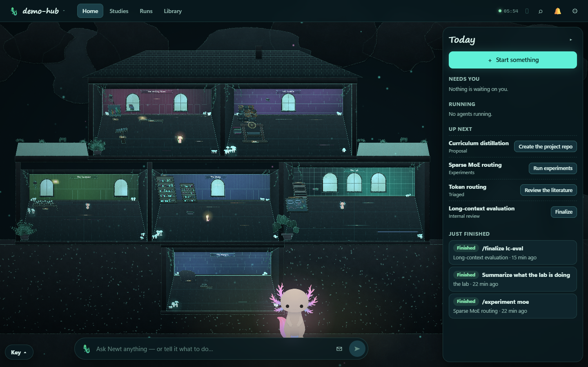
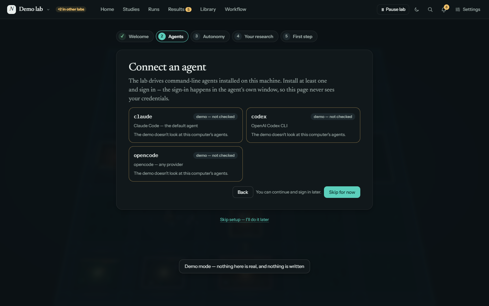
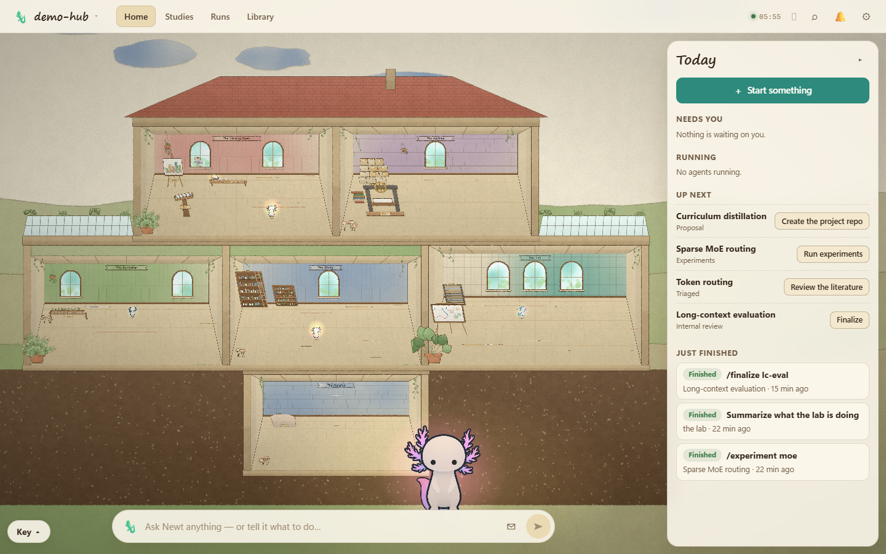
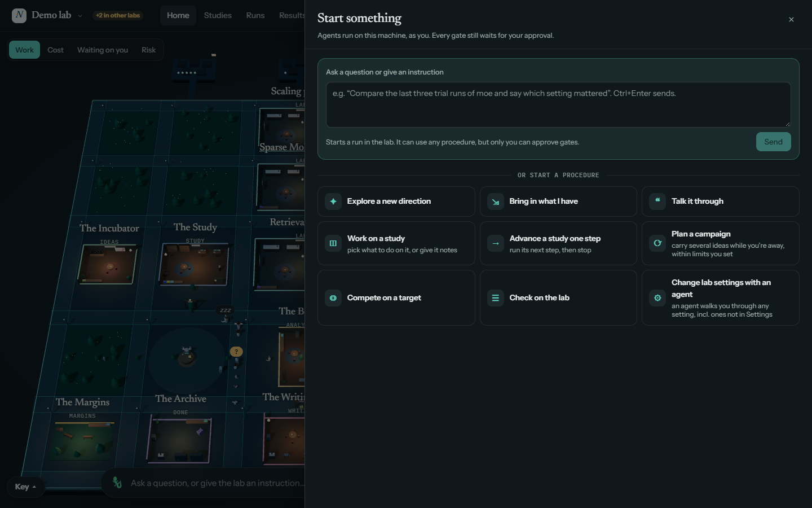
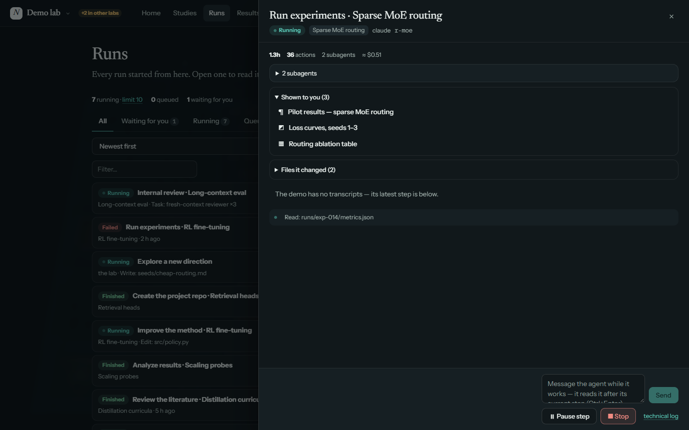
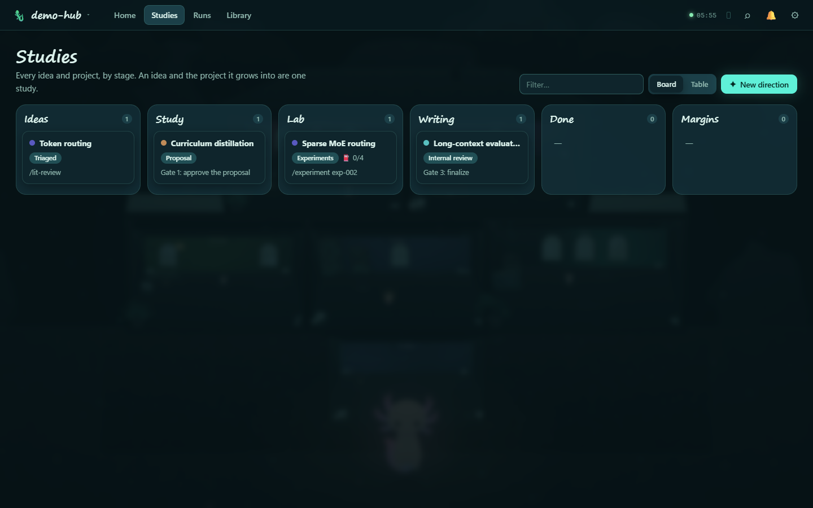
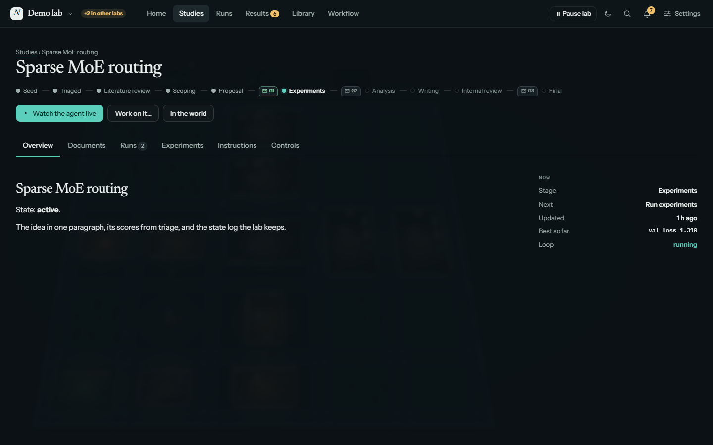
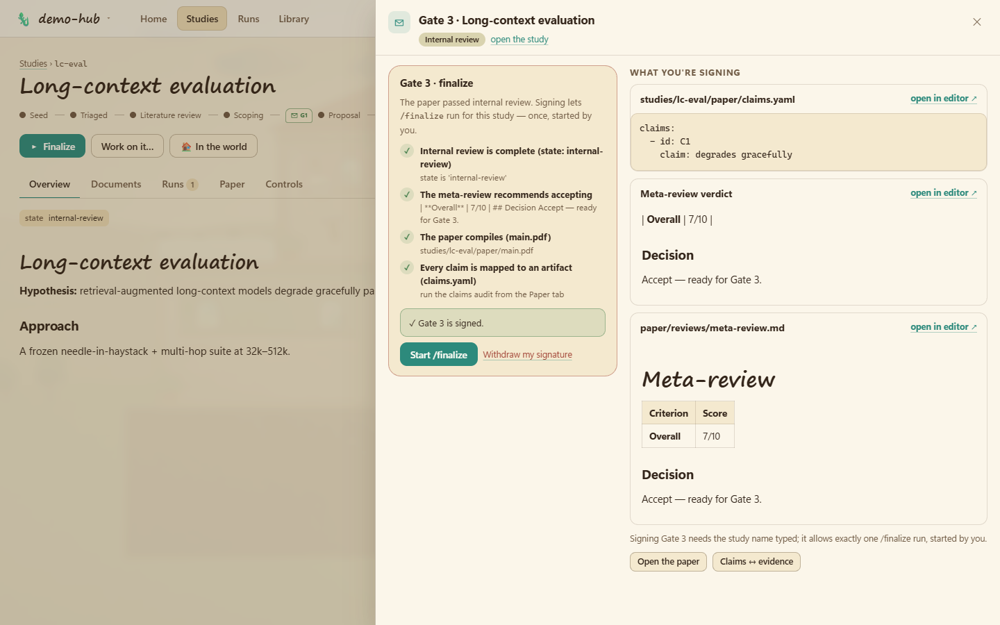

# The dashboard

*Local-only. Nothing leaves your machine. Delete the `dashboard/` folder and the lab still works from a terminal.*

The dashboard is the lab's product surface. **Start it, pick or create a lab, and do everything from
there:** set up the lab, connect an agent, start work, watch it, answer its questions, and sign the
gates. The lab itself is drawn behind it as a living paper diorama.

<figure markdown>
{ .as-shot }
<figcaption><strong>Home</strong>: the lab drawn as a cutaway building, a room per lifecycle stage. The <strong>Today</strong> rail on the right lists what needs you, what's running and what's next. <strong>Ask Newt</strong> sits underneath.</figcaption>
</figure>

## Start it

Double-click **`Start Newts Lab.cmd`** (Windows) or **`start-newts.command`** (macOS), or run:

```bash
uv run --with pyyaml python newts.py
```

It starts the server for the lab in that folder and opens your browser at `http://127.0.0.1:8787`.
If 8787 is taken it picks the next free port. If the dashboard is already running for that lab it
just opens the browser. Options: `--hub <another lab>`, `--port`, `--no-browser`. The server binds
`127.0.0.1` only. The only prerequisite is [uv](https://docs.astral.sh/uv/).

**On a remote machine.** Run `newts.py --background` there: it keeps running after you log out, and on a
box with no desktop it prints the `ssh -L` line to use from your computer. Or skip that entirely and add
the machine to your local dashboard (below). See [Machines & compute](compute.md).

**Labs & machines.** Click the lab's name at the top left to reach **Labs & machines** (`#/labs`). From
there you can:

- **Open** a recent lab, or any folder that contains `lab/config.yaml`.
- **Create a new lab**: a name and a place. The dashboard copies this template's committed files,
  empties the registry and knowledge base, points the new lab's projects at a sibling
  `<name>-projects` folder, and makes the first git commit (`tools/new_lab.py`).
- **Switch** labs live. Agents that are running keep running, and the old lab's queue keeps moving.
- **Add a machine** you reach over SSH (your `~/.ssh/config` hosts are suggested) and open its labs.
  - The dashboard starts that lab's own server there and tunnels to it. Everything then runs on that
    machine while you use it from here, and the top bar says *on &lt;machine&gt;*.
  - Password or MFA hosts connect through a terminal window you sign in to.
  - You can also create a lab on the remote, or install uv there.

## First run: the setup wizard

A lab that hasn't been set up opens the wizard (`#/setup`). You can skip it and come back from
Settings → About.

1. **Welcome.** What the lab is: the lab folder, a project repo per approved study, and the three
   gates only you sign.
2. **Agents.** One card per agent CLI (Claude Code, Codex, opencode), showing whether it is
   installed, which version, and whether it is signed in.
   - **Install…** opens a terminal window that runs the installer, so you watch it.
   - **Sign in…** opens a terminal running the CLI's *own* login (`claude auth login`, `codex login`,
     `opencode auth login`): a window on this computer, or an in-browser terminal when the lab is on a
     remote machine or one without a desktop. Your credentials go to the CLI, never to the page. The
     card updates by itself when you finish.
3. **Autonomy.** Plain-language choices:
   - starting agents from the dashboard (on or off);
   - the default agent;
   - the budget tier (low / medium / high);
   - how many training runs this machine can run at once;
   - oversight (standard or strict);
   - a daily run limit.

   All of it is written to `lab/config.yaml`, and every change is logged.
4. **Your research.** `/setup-lab` runs as a conversation: research areas and first directions,
   compute, venue, and which models play which roles. Its questions appear as forms you answer in
   place.
5. **First step.** Four on-ramps: *Explore a new direction* (`/ideate`), *Bring in what I have*
   (`/adopt`), *Talk it through* (`/discuss`), and *Compete on a target* (`/compete`).

<figure markdown>
{ .as-shot }
<figcaption>Step 2 of the wizard: one card per agent CLI. <em>Sign in…</em> opens the CLI's own login in a terminal window; the card turns green by itself.</figcaption>
</figure>

## Home

The world fills the screen. Each lifecycle stage is a room of one cutaway building, each idea or
project is a critter in its room, and each working agent or subagent is a sub-newt at its station
(see [The world](#the-world)).

On the right, the **Today** rail (collapsible) has:

- **Start something**: the one button for starting work.
- **Needs you**: gates to sign, questions from agents, permission requests, crashed runs,
  escalations and silent subagents. Each row can be acted on in place: answer, sign, allow or deny,
  resume.
- **Running**: live and queued runs, with elapsed time against their budget and what each is doing
  now.
- **Up next**: each study's natural next step as a one-click button.
- **Just finished**: the latest runs and their reports.
- **Since you were last here**: what changed while you were away.

Underneath is **Ask Newt**, where you type anything (see [Ask Newt](#ask-newt-free-form)). The ✉
button next to it leaves a *note* for the next agent instead, without starting anything.

In the world itself:

- Click a critter to peek at its study: its stage, its next step, its runs, and *enter its lab*.
- Click a room to zoom in. A room map and **◂ back** appear top-left.
- Click a sub-newt to open its inspector: what it is doing, who started it, its subagents, what it
  handed back, and its full action timeline. **Follow** keeps the camera on it.
- Click Newt, bottom-centre, to start something.
- The **Key** (bottom-left) lists the roles with live counts. Click a role to highlight its agents.

The same list as *Needs you* sits behind the 🔔 in the top bar. The tab title shows how many things
are waiting, and **desktop notifications** (⚙ Settings → Notifications) tell you when an agent asks
something, a gate opens, or a run finishes or fails.

<figure markdown>
{ .as-shot }
<figcaption>The same Home by day — the parchment atelier. Theme follows your system, or pick one in Settings → Appearance.</figcaption>
</figure>

## Starting work

**Start something** opens one sheet. At the top is Ask Newt. Below it are the procedures, in plain
words:

| Intent | Runs | Stops |
|---|---|---|
| Explore a new direction | `/ideate <direction>` | when the best 1–3 ideas are filed as studies |
| Bring in what I have | `/adopt` | once the idea / repo / draft is in the lifecycle |
| Talk it through | `/discuss` (a conversation) | crosses no gate |
| Work on a study | the procedures that fit its stage: `/lit-review`, `/scope`, `/propose`, `/experiment`, `/improve`, `/research-loop`, `/analyze`, `/make-figures`, `/write-paper`, `/critique-paper`, `/review-paper` | at the procedure's own stop point, or at a gate |
| Advance a study one step | `/advance` | after one stage |
| Plan a campaign | writes and signs a campaign brief, then `/autopilot` | at anything outside the brief's bounds |
| Compete on a target | `/compete` (an interview) | at its own Gate 1 |
| Check on the lab | `/lab-status` | with a recommendation |

Each intent says **what happens**, **where it runs** (in the lab, or inside the study's project
repo) and **where it stops**. **Options** override, for that run only:

- the agent (claude · codex · opencode) and the model;
- the effort level and the time limit;
- what happens when it finishes: *stop and report*, *run its reported next step*, or *keep going
  until a gate*;
- **repeat every N minutes**, e.g. `/autopilot` every 30 minutes, which stops at a gate or a failure.

The first time you start something, the dashboard asks once to turn on **starting agents from the
dashboard** (the `agents.programmatic.enabled` switch). Runs are queued first and start as soon as a
slot is free, within the concurrency caps and the daily limits set in Settings → Autonomy.

<figure markdown>
{ .as-shot }
<figcaption><strong>Start something</strong>: Ask Newt on top, then every procedure in plain words. Picking a study lists what fits its stage.</figcaption>
</figure>

### Ask Newt (free-form)

Type any instruction, e.g. *"compare the last three pilots of moe and tell me which knob mattered"*,
in the bar under the world or at the top of Start something. A short confirmation shows:

- where it runs: the whole lab, or a chosen study (inside its project repo if it has one);
- the agent, the model and the time limit.

It becomes an ordinary run (skill `ask`) with the lab's standing instructions and every hook,
including the [signature guard](#signatures-only-you-sign). It can use any of the lab's procedures,
and it can never sign a gate. Continue it by replying. Free-form runs don't chain; a next step they
report shows as a button.

## Runs are conversations

Open any run (from Home, Runs, a study, or a notification) and it reads like a chat:

- **The agent's messages**, rendered as Markdown.
- **Its tool calls, folded into groups**, e.g. "ran 6 commands · edited 2 files". Click to expand.
- **Subagents** appear inline when they start and when they hand back. A strip at the top lists each
  one's role, what it is doing and its result.
- **Questions become forms.** When a procedure needs you (the project type at `/spawn-project`, an
  interview question), the run pauses on the question. Pick an option or type your own answer, and
  the same session continues where it stopped.
- **Permission requests** show *Allow once / Deny* inline, when `permission_wait_seconds` is set.
  Otherwise a blocked action is denied and listed under *Needs you*.
- **The report** comes at the end: a summary, whether it stopped at a gate or a kill criterion, and
  its next command as a button (**Review and sign** when it stopped at a gate).

At the bottom:

- **Reply** in your own words to a paused or finished run; it continues the same conversation.
- **Stop** ends it but leaves it resumable, and **Resume** continues it (claude `--resume`, codex
  `exec resume`, opencode `-s`).
- A queued run can be cancelled.
- Links to the raw transcript and the supervisor log.

The **Runs** page lists every run, filterable by *waiting for you*, *running*, *queued*, *finished*
and *failed*, with the slot usage and the agents at work right now.

Runs belong to the executor, not to the page. Close the dashboard and they keep going; reopen it and
they are all still there. The same engine has a CLI, `tools/executor_cli.py`.

<figure markdown>
{ .as-shot }
<figcaption>A run opens as a conversation: messages, folded tool calls, the report, and a reply box that continues the same session.</figcaption>
</figure>

## Studies

**Studies** is a pipeline board with one column per room: *Ideas · Study · Lab · Writing · Done ·
Margins*. Each card shows its stage, a waiting gate, live runs, its agents and its FULL-run budget.
A table view is one toggle away.

A **study page** (`#/study/<slug>`) has:

- **a lifecycle stepper** from seed to final. The gates are drawn as doors between steps: one glows
  when it waits for you, and it opens once signed.
- **one primary button** for the natural next step: *Review and sign Gate 1*, *Run experiments*,
  *Answer its question*, and so on. **Work on it…** offers everything else that fits.
- the tabs:
  - **Overview**: the idea write-up (`IDEA.md`), where it stands now, its agents, any notes still
    waiting for an agent, and recent events.
  - **Documents**: every file of the study and its project repo, rendered.
  - **Runs**: its conversations.
  - **Experiments**: what is training now, with budget bars, a peek at each run's artifacts,
    *project status*, *compare runs*, the effective config, and buttons to start experiments,
    improve, the research loop and analysis.
  - **Paper**: the compiled PDF (it reloads when the agent recompiles), its figures, and **Claims ↔
    evidence**, where every claimed number is traced to the run artifact it comes from, with a
    one-click claims audit.
  - **Controls**: start or stop the research loop, switch it between execute and explore, run a
    smoke test, request a run, the envelope editor, prioritize, park, kill or revive, and the
    signatures.

<figure markdown>
{ .as-shot }
<figcaption>The <strong>Studies</strong> board — a column per room of the building.</figcaption>
</figure>

<figure markdown>
{ .as-shot }
<figcaption>A <strong>study page</strong>: the lifecycle stepper with its gates as doors, one next-step button, and the tabs.</figcaption>
</figure>

## Signatures: only you sign

Every signature follows one pattern. A **gate sheet** puts the review bundle and the signing controls
side by side, so reading never closes it. It says exactly what gets written, asks you to confirm,
logs the signature to `lab/.bus/pi-actions.jsonl`, and lets you **withdraw** it.

- **Gate 1: the proposal.** You approve the hypothesis, the frozen evaluation, the staged plan, the
  budgets and the kill criteria. Tick *also approve the Gate-2 envelope (§5)* to let FULL runs within
  it proceed once the project exists. Next comes *Create the project repo* (`/spawn-project`), or it
  is queued automatically with `dashboard.auto_spawn_on_gate1: true`.
- **Gate 2: the FULL-run envelope.** Edit the numbers (FULL runs, minutes per run, total minutes,
  expiry) against a live capacity readout, then sign. The readout counts runs completed and reserved
  in flight, which is the same accounting `guard.py full-run` enforces. Changing a signed envelope's
  values withdraws the signature until you sign again.
- **Gate 3: finalize.** A readiness checklist comes first: internal review is complete, the
  meta-review recommends accepting, the paper compiles, and the claims are mapped. Beside it are the
  claims, the meta-review and every review.
  - Signing requires **typing the study's name**, and writes `studies/<slug>/paper/gate3-approval.md`
    (`signed_via: dashboard:<time>`, with the paper's hash).
  - It allows exactly **one `/finalize` run, started by you**, right away or later from the same
    sheet. No chain, repeat, campaign or free-form run can start it.
- **The loop brief.** Read the project's `LOOP_BRIEF.md`, choose *execute* or *explore*, and
  authorize it. The research loop then runs unattended within it.
- **A campaign.** *Plan a campaign* is a form: direction, how many ideas, how many at once, compute,
  the FULL runs each project may use, wall-clock, loop mode and re-entry interval. Signing writes
  `lab/campaigns/<date>-<slug>.md` and can start `/autopilot` on a repeat right away. Within its
  bounds the campaign self-approves Gate 1 and derives each project's envelope; Gate 3 is never
  delegated.
- **Revive** brings a parked or killed idea back into Ideas. A reason is required and is recorded in
  the registry and in `IDEA.md`.

<figure markdown>
{ .as-shot }
<figcaption>The <strong>Gate 3</strong> sheet: the readiness checklist and the signing controls beside the claims, the meta-review and every review. Signing needs the study's name typed.</figcaption>
</figure>

**The signature guard.** Every run started from the dashboard, whether a procedure or free-form,
carries `tools/signature_guard.py`. It is a pre-tool hook wired into claude (the run's settings),
codex (`-c hooks` flags) and opencode (a plugin), and it **denies** any agent write that would create
or change a signature:

- a Gate-1 marker, an envelope's `pi_signed` or `signed_via`, or a signed envelope's values;
- `gate3-approval.md`;
- a LOOP_BRIEF or campaign authorization;
- a registry row moved to `final` without a signed Gate 3;
- PI-owned config;
- the PI-action log;
- the shell escape hatches.

Delegation under a PI-signed campaign brief still works, because those signatures name the brief.
A denial surfaces under *Needs you*. That guarantee is what makes free-form runs and a dashboard
Gate 3 safe to offer.

## Library, History, Settings

- **Library.** Every document the lab writes, organized and rendered offline, with tables, code,
  KaTeX math and inline images:
  - the lab layer: ideation worksheets, knowledge, notebook, campaigns;
  - one shelf per study: idea → lit review → decisions → proposal → sessions → critiques → paper and
    reviews;
  - each study's project-repo ledgers.

  Two PI documents are edited in place: `lab/SYSTEM.md` (describe this machine for the agents) and
  the open questions `/ideate` reads first.
- **History.** Every event in the lab, and every command and note you sent with its `pending → seen
  → done` state and evidence (a `done` with no evidence is flagged).
- **Settings**, by section:

  | Section | What it holds |
  |---|---|
  | Agents & sign-in | the CLI cards from the wizard |
  | Autonomy & limits | the launching switch; default agent and model; what claude may do without asking; time limits; concurrency caps; daily limits; the *keep going* cap; how long to wait for your allow/deny; create the project when Gate 1 is signed |
  | Lab | name, where projects go, training runs at once, projects per campaign, oversight, venue, page limit, budget tier; anything else goes to an agent via `/configure` |
  | Research keys | Semantic Scholar, OpenAlex and others, kept in the git-ignored `lab/.env.local` and handed to runs; never shown again |
  | Appearance | theme day / night / system, density, world diorama / classic, motion, narration |
  | Notifications | desktop notifications |
  | System & compute | what the lab's machine offers (CPUs, memory, GPUs, disk, schedulers, SLURM partitions), where training runs (here / SLURM / another scheduler, with `compute.scheduler` prefilled from what was detected), SYSTEM.md |
  | About & server | the lab, a terminal in the lab folder, the setup wizard, **stop the server** |

The **command palette** (<kbd>/</kbd> or <kbd>Ctrl</kbd>+<kbd>K</kbd>) jumps to any study, run, page
or action. <kbd>Esc</kbd> closes the top layer.

## What still happens outside the dashboard

- Editing code and experiment configs, and committing or pushing git: use your editor (every
  document has *open in editor ↗*, via `dashboard.editor`).
- A target-driven `/compete` project's Gate 3 (selecting its final output) and anything that
  actually leaves the lab (arXiv, a submission) stay yours, in a session.
- The CLI's own sign-in happens in the terminal window the dashboard opens for it.

## The world

The lab is one cutaway building drawn by code (`dashboard/static/world/`, rendered with PixiJS).
There is a room per lifecycle stage, floors stacked, and the Margins in the cellar. The gates are
the doors between rooms.

| Room | Covers |
|---|---|
| **the incubator** | `seed`, `triaged` |
| **the study** | `lit-review`, `scoping`, `proposal` (**Gate 1** is the door out) |
| **the lab** | `active`, `analysis` (**Gate 2** inside). Each project is one critter; enter it to see its workers |
| **the writing room** | `writing`, `internal-review` (**Gate 3** is the door out) |
| **the archive** | `final` |
| **the margins** | `parked` (dim) and `killed` (sunk) |

By day the world is the parchment atelier; by night it is the cave. Its objects are live readouts:

- the compute rack's LEDs are the slots in use;
- the FULL reactor bubbles with load;
- screens scroll while agents work;
- a waiting gate's door glows;
- the clock is real.

When a study changes stage, its critter hops to the new room. The painted world is the fallback
without WebGL (⚙ Settings → Appearance → World). New rooms and furniture use the same design
language, described in [The world's design language](world-design.md).

## How it stays honest (the bus)

Everything shown is backed by a real file. The signal layer is **the bus**: append-only JSONL, the
same philosophy as the rest of the lab.

- **Mechanical events** fire from code, so the scene is truthful even if an agent forgets to narrate:
  `scripts/run.py` and `sweep.py` emit `run_started`, `run_finished` and `sweep_*`, and
  `tools/run_slots.py` emits slot events.
- **Agent events.** At registry changes, gate stops, loop cycles, pivots, kills and write-backs, the
  agent emits `lab_bus.py emit <kind>`.
- **Commands, notes, acks and PI actions** flow through the same files. The dashboard appends. For a
  signature it edits exactly the line it is told to, and verifies the file still parses to what it
  meant.

The event kinds are listed in `tools/lab_bus.py`. The main ones:

- lifecycle: `state_change`, `gate_waiting`, `gate_resolved`, `gate_revoked`;
- experiments: `run_started` / `run_finished`, `sweep_*`, the slot events;
- process: `cycle`, `review_verdict`, `paper_compiled`, `kill`, `writeback`, `replan`,
  `frontier_expand`, `decision_revisit`, `approach_ideate`;
- escalations: `escalation` / `escalation_resolved`;
- agent runs: `agent_launched`, `agent_waiting`, `agent_resumed`, `agent_finished`, `run_report`.

The bus lives in the git-ignored `lab/.bus/` (hub) and `<project>/.bus/` (each project).

## Traceability: one log per worker

Claude Code hooks (`.claude/settings.json` → `tools/trace_hook.py`), the Codex hooks and the opencode
plugin log every agent's and subagent's activity to **one file per worker**:
`lab/.bus/workers/<id>.jsonl` in the hub and `<project>/.bus/workers/<id>.jsonl` in each project.
What gets logged:

- each subagent's birth;
- each tool call, as it starts and as it ends;
- each spawn, with its description;
- what each subagent handed back.

`dashboard/sources.py` rebuilds the run → session → subagent tree from these logs. The logs are
written by the harness, not by the subagents. They are best-effort and never block a tool call.
This works with or without the dashboard.

## Tech notes

- **Server.** `dashboard/serve.py` is a stdlib `ThreadingHTTPServer` (plus pyyaml), and
  `dashboard/product.py` holds the PI actions beyond the gates and the launcher. The lab's files are
  the database:
  - `GET /api/state` is a snapshot rebuilt from files, cached for about 1 s.
  - `GET /api/events` is Server-Sent Events, polled every 1.5 s.
  - Each run has `GET /api/run`, `/api/run/tail` and `/api/run/log`.
  - Writes are JSON POSTs. Each one is validated, needs an explicit `confirm` where it widens
    authority, and is logged.
- **Protection.**
  - The server binds 127.0.0.1 only, and on Windows it binds the port exclusively, so two servers
    can't silently share it.
  - Host and Origin checks defeat DNS rebinding. `Origin: null` is refused.
  - A per-server **`SameSite=Strict`, `HttpOnly` session cookie** is set with the page and required on
    every `/api` call, so another site, a `file://` page or a sandboxed frame can't drive the lab.
  - POSTs must be `application/json`.
  - The inline snapshot seed is `</`-escaped.
- **Front end.** `static/ui/*.js` (Preact 10 + htm, vendored UMD builds, no build step) and
  `static/ui/ui.css`.
  - Colours are tokens on `:root`, matching the world's day and night palettes.
  - Hash routes: `#/`, `#/studies`, `#/study/<slug>/<tab>`, `#/runs`, `#/run/<id>`,
    `#/library/<scope>/<slug>/<file>`, `#/settings/<section>`, `#/history`, `#/labs`, `#/setup`.
  - Old deep links (`?open=<slug>`, `?read=<scope>:<slug>:<rel>`) still work.
- **The world.** `static/world/scene.js` holds the one `Scene` wrapper and the classic painted world.
  The diorama is `engine.js` with its tokens, painter, components and rooms, and
  `static/world/gallery.html` shows every component and room in both themes.
- **Vendored libraries** (offline, with licences in `static/vendor/`): PixiJS, Preact, htm, marked,
  DOMPurify and KaTeX.
- **Demo mode**, for debugging: start with `--demo` and open `/?demo`. It is a synthetic living lab,
  and nothing is written.
