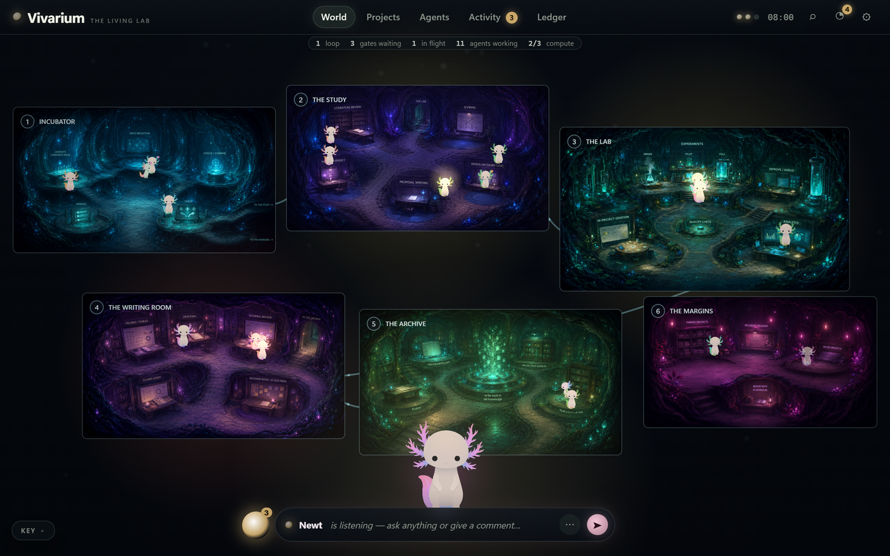

# Newts' Lab

<div class="as-hero" markdown>
<p class="as-kicker">A research lab for an AI agent</p>
<p class="as-lede">Newts' Lab takes a research direction from <strong>ideation</strong> through literature review, proposal, experimentation, analysis and ablations, to a <strong>finished LaTeX paper</strong> — driven by an agent, with you as the PI at three explicit gates.</p>

[Getting started](getting-started.md){ .md-button }
[Autonomy & modes](autonomy.md){ .md-button .md-button--secondary }
</div>

It is a *template*, not a framework: procedures are Markdown skills the agent executes with judgment, state is plain files and git, and nothing here assumes a research domain. The design distills what worked across the autonomous-research literature — Sakana's AI Scientist, Karpathy's autoresearch, Google's co-scientist, Kosmos, Meta's AIRA — and hard-codes defenses against their documented failure modes. The full reasoning lives in [Design rationale](DESIGN.md).

<figure markdown>
{ .as-shot }
<figcaption>Optional, local-only, offline: the <a href="dashboard/">Vivarium dashboard</a> renders the whole lab as a living world — each idea or project a critter, every working agent a sub-newt, in the room of its current stage. Delete it and the lab is unchanged.</figcaption>
</figure>

## The shape of the lab

```
        ┌────────────────────────  HUB (this repo)  ────────────────────────┐
        │  /ideate → /lit-review → /scope → /propose ──[PI gate]──┐         │
        │                                                         ▼         │
        │  lab/knowledge ◄── /finalize ◄── /review-paper ◄── /write-paper   │
        └───────▲────────────────────────────────────────────────▲──────────┘
                │                                                │
                │   ┌── SPOKE (../newts-lab-projects/<slug>) ┴───┐
                └── │  /spawn-project → /experiment → /improve →     │
          findings  │  /analyze   (own git repo, own env, own        │
                    │  control.yaml — independently reproducible)    │
                    └────────────────────────────────────────────────┘
```

The **hub** (this repo) holds ideas, literature reviews, proposals, papers, accumulated knowledge, and the executable procedures. Every approved proposal **spawns a project repo outside the hub** — independently cloneable, reproducible, and extensible by humans. Findings flow back and compound in `lab/knowledge/`, so each project starts smarter than the last.

## The three PI gates

Everything between gates runs autonomously. Everything at a gate stops for you.

| Gate | When | What you approve |
|---|---|---|
| **1 — Proposal** | before any compute is spent | hypothesis, baselines, staged plan, budgets, kill criteria — optionally a Gate 2 envelope |
| **2 — Full scale** | before any FULL-stage run | the expensive runs (or pre-authorize an envelope for unattended loops) |
| **3 — Finalization** | before anything leaves the lab | the paper, after it survives the internal review ensemble |

## Load-bearing principles

1. **Every reported number traces to a run artifact** — enforced mechanically by `tools/audit_claims.py`, not by promise.
2. **Staged scale** — smoke → pilot → full; most ideas die cheaply at pilot.
3. **Git is memory** — one commit per experiment attempt; append-only ledgers; nothing lives only in a chat transcript.
4. **Frozen things stay frozen** — eval protocol, test sets, seeds, budgets. The watchdog enforces budgets in code.
5. **Fresh eyes review** — papers are critiqued by reviewer subagents that never saw them written, calibrated against the human scoring mean.
6. **Knowledge compounds** — findings, failures, and open questions persist in the hub and seed the next ideation round.

## Where to go next

<div class="grid cards" markdown>

-   **Getting started**

    ---

    Instantiate the template, run the `/setup-lab` interview, pick your on-ramp.

    [Getting started →](getting-started.md)

-   **Autonomy & modes**

    ---

    Manual, stage-gated (`/advance`), project loops, or full `/autopilot` — and how they compose with the built-in `/loop`.

    [Autonomy & modes →](autonomy.md)

-   **The workflow**

    ---

    Lifecycle states, the three gates, the paper-refinement loop and its safeguards — plus how to start anywhere with `/adopt`.

    [The workflow →](workflow.md)

-   **Skills reference**

    ---

    Every procedure: what each does, what it reads, where it stops.

    [Skills reference →](skills.md)

-   **Configuration**

    ---

    The 3-layer config system and every key, with per-key ownership (PI vs agent).

    [Configuration →](configuration.md)

-   **Projects & tools**

    ---

    Anatomy of a spawned project, the reproducibility contract, and the mechanical helpers.

    [Projects →](projects.md) · [Tools →](tools.md)

</div>
